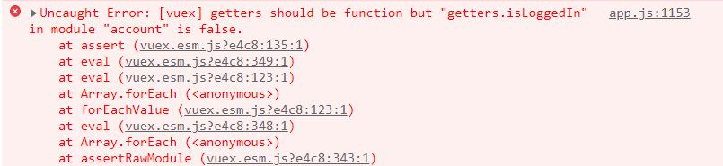
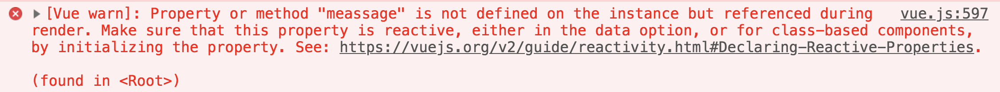
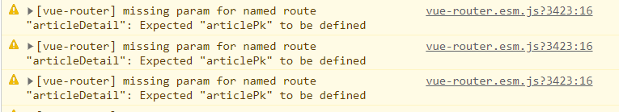
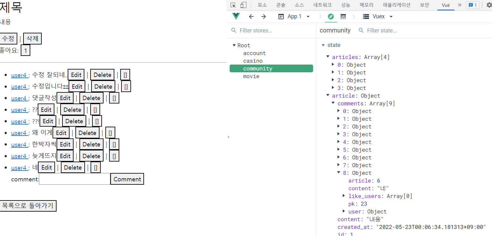

### 오류가 키워 준 지식 :v: (FE - Vue)

---

- module을 나눠서 사용하면 다른 파일들은 `new Vuex.Store` 붙일 필요 없이 그냥 `export default ({})` 로 작성하면 된다! 이미 index가 생성해뒀기 때문! 
  - 
  - Uncaught Error가 뜬다!

---

- template 부터 위에서 아래로 렌더링 된다 .. 

  props 데이터를 템플릿에서 쓰려고해서 문제가 생겼다 .... 큰 문제가 .. 

  - 이전 코드 : getters를 써서 state에 있는 pk 값을 data에 집어넣어서 사용하려고 함. 
    - undefined 오류가 뜸
    -  
    - 이름만 다르고 같은 오류가 뜸
    - **속성이 선언되지 않았는데 화면에 렌더링 되려고 했습니다**
  - 해결 방법 
    - 1. props에 userPk 값을 넣어서 받아올 수 있나 확인
      2. main view 에서 router-link params를 1번에서 성공한 값으로 넣어서 path가 문제인지 데이터 값이 문제인지 체크
      3. 데이터가 문제였다 ... 
      4. data에 담아서 넘기던 코드를 computed를 사용해 넘겨줌! 
      5. params값이 string으로 들어가는 문제 발생 ...
    - **코드 싹 지우고 .... profile 페이지에서 userPk 싹 빼서 처리**
      - **dj-rest-auth  사용해서 request에 이미 정보가 담겨있었다.** 

---

- Pk 값에 대체 무슨 문제가 있던 걸까요 
  - 
  - article 작성 됨 => article Detail로 이동해야하는데 articlePk값이 없다고 한다 ,,, 하지만 getters.article.id 에 분명 값이 잘 들어있습니다 ㅠㅠ 
  - 모든 코드에서 pk값이 말썽을 부리는 문제가 발생합니다 ......
  - router.params에서 꺼내서 해결!

---

- 댓글이 생성은 되는데요? 이게 좀 이상합니다
  - 
  - 1. 댓글을 새로 작성하면 위처럼 댓글들이 다 뜬다 (방금 새로 작성한 댓글은 제외....)
    2. 새고하면 다른 댓글들은 다 지워지고 => 해당 article에 속한 댓글만 잘 뜬다... 
    3. 생성 / 수정 / 좋아요에서 같은 문제 발생
  - 수정이 진행되면 수정된 정보를 보내줘야하는데 시리얼라이저 맨 앞에서 받아온 애들을 넘겨주면 수정이 반영이 안된다... 그래서 return 해주기 전에 수정된 정보들을 다시 받아서 serialize 시킨 후 반환!
  - 

---

- Pk값을 찾지 못할 때는 내가 값을 제대로 찾아서 넣어줬는지 확인하자... 

---

- 새로고침 할 때 NavigationDuplicated 오류가 뜬다.. 

  - 기능은 작동하지만 자꾸 오류가 나서 ..... 이런식으로 catch err => err 해줬다
  - Error Handling
    - **에러 핸들링 미들웨어**라고한다 

  ```js
          router.push({
            name: "moviesearchview",
            params: {
              keyword: getters.keyword,
            },
          }).catch(err => err)
  ```


------

- 프로필에 본인 카드 목록을 페이지네이션으로 구현, 등급별로 구분해서 보여줄 수 있도록 구현


- ```vue
  <template>
    <div>
  
      <div class="card-deck container">
        <div class="row" style="justify-content: normal;">
  
  
          <div style="border-radius: 10px;" v-b-modal.modal-card @click="[storePerson(card)]" class="card profile-card col-2 m-3 mx-3.5" :class="{'platinum': card.popularity >= 40, 'gold': card.popularity < 40, 'silver': card.popularity < 21, 'bronze': card.popularity < 14}" v-for="card in paginatedData" :key="card.pk">
            <div class="card-header">
            </div>
            
            <div class="card-body profile-card-body" style="text-align: center;">
              <div style="vertical-align: middle;" class="card-title">{{ card.name }}</div>
  
            </div>
          </div>
  
          <b-modal id="modal-card" hide-footer hide-header size="lg" title="BACKGACHA" no-close-on-backdrop body-bg-variant="dark">
            <div class="container-fluid">
              <div class="row">
                <div class="col-md-4">
                  <div style="border-radius: 10px;" class="card modal-card" :class="{'platinum': personInfo.popularity >= 40, 'gold': personInfo.popularity < 40, 'silver': personInfo.popularity < 21, 'bronze': personInfo.popularity < 14}">
                    
                    <div class="card-body modal-card-body">
                      <div style="vertical-align: middle; text-align: center; font-size: 1.5rem;" class="card-title">{{ personInfo.name }}</div>
                    </div>
                    </div>
                </div>
                <div class="col-md-8 infoText text-align: center;">
                  <h2 class="modal-card-text">
                    <span class='modal-card-title'>이름 : </span>{{ personInfo.name }}
                  </h2>
                  <h3 class="modal-card-text">
                    <span class='modal-card-title'>생일 : </span>{{ personInfo.birthday }}
                  </h3>
                  <h3 class="modal-card-text">
                    <span class='modal-card-title'>출생지 : </span>{{ personInfo.place_of_birth }}
                  </h3>
                    <h3 class="modal-card-title">출연작</h3>
                  <div class='modal-movie-list'>
                    <div class='modal-movie-list-box' v-for="movie in personInfo.movie_ids" :key="movie.pk">
                      <br>
                      <router-link class="modal-card-text-movie" style="text-decoration: none;"  :to="{ name: 'moviedetail', params: { moviePk: movie.pk } }">
                        {{ movie.title }}
                      </router-link>
                      
  
                    </div>
                    
                  </div>
                  
                </div>
              </div>
            </div>
            
            <div class="modal-button-box">
              <button class="mt-3 modal-stash-button" block @click="[$bvModal.hide('modal-card'),]">
                  닫기
              </button>
              
            </div> 
          </b-modal>
            
        </div>
      </div>
  
      
      <div class="btn-cover">
        <button :disabled="pageNum === 0" @click="prevPage" class="page-btn">
          이전
        </button>
        <span class="page-count">{{ pageNum + 1 }} / {{ pageCount }} 페이지</span>
        <button :disabled="pageNum >= pageCount - 1" @click="nextPage" class="page-btn">
          다음
        </button>
      </div>
    </div>
  </template>
  
  <script>
  export default {
    name: 'paginated-list',
    data () {
      return {
        pageNum: 0,
        personInfo: {}
      }
    },
    props: {
      listArray: {
        type: Array,
        required: true
      },
      pageSize: {
        type: Number,
        required: false,
        default: 10
      },
      pageNumber: {
        type: Number,
        required: false,
        default: 0
      }
    },
    methods: {
      nextPage () {
        this.pageNum += 1;
      },
      prevPage () {
        this.pageNum -= 1;
      },
      goFirstPage () {
        this.pageNum = 0
      },
      storePerson(a) {
        this.personInfo = a
      }
    },
    computed: {
      pageCount () {
        let listLeng = this.listArray.length,
            listSize = this.pageSize,
            page = Math.floor(listLeng / listSize);
        if (listLeng % listSize > 0) page += 1;
        
        /*
        아니면 page = Math.floor((listLeng - 1) / listSize) + 1;
        이런식으로 if 문 없이 고칠 수도 있다!
        */
        return page;
      },
      paginatedData () {
        const start = this.pageNum * this.pageSize,
              end = start + this.pageSize;
        return this.listArray.slice(start, end);
      }
    }
  }
  </script>
  ```
  
  - 이 때, 만약 Silver 페이지에서 7/10을 보고 있다가 Platinum 버튼을 누를 경우 7/2 이런식의 사용자 비친화적인 현상이 발생, 따라서 등급 버튼을 눌렀을 때 Pagenum이 0이 될 수 있도록 처리함

  ```javascript
  data () {
      return {
        pageNum: 0,
        personInfo: {}
      }
    },
    props: {
      listArray: {
        type: Array,
        required: true
      },
      pageSize: {
        type: Number,
        required: false,
        default: 10
      },
      pageNumber: {
        type: Number,
        required: false,
        default: 0
      }
    },
  ```
  
  

  ```javascript
  methods: {
      nextPage () {
        this.pageNum += 1;
      },
      prevPage () {
        this.pageNum -= 1;
      },
      goFirstPage () {
        this.pageNum = 0
      },
      storePerson(a) {
        this.personInfo = a
      }
    },
  ```
  
   goFirstPage()는 PaginatedList라는 하위 컴포넌트에서 정의된 함수이고, 이를 AccountView라는 상위 컴포넌트에서 사용하기 위해선 조치가 필요함

  ```javascript
  methods: {
      ...mapActions(['fetchProfile']),
      sortPageArray() {
        this.pageArray = this.profile.person_ids.sort(function (a,b) {
          return b.popularity - a.popularity;
        })
      },
      platinumPageArray() {
        this.pageArray = this.profile.person_ids.filter(function(a){
          return a.popularity >= 40
        })
      },
      goldPageArray() {
        this.pageArray = this.profile.person_ids.filter(function(a){
          return a.popularity < 40 && a.popularity >= 21
        })
      },
      silverPageArray() {
        this.pageArray = this.profile.person_ids.filter(function(a){
          return a.popularity < 21 && a.popularity >= 14
        })
      },
      bronzePageArray() {
        this.pageArray = this.profile.person_ids.filter(function(a){
          return a.popularity < 14 && a.popularity >= 10
        })
      },
      goToFirstPage() {
        this.$refs.PaginatedList.goFirstPage()
      }
    },
  ```
  
  ```vue
  <div v-else>
                                    <button class="profile-card-button" @click="[platinumPageArray(), goToFirstPage()]">Platinum</button><span>|</span>
                                    <button class="profile-card-button" @click="[goldPageArray(), goToFirstPage()]">Gold</button><span>|</span>
                                    <button class="profile-card-button" @click="[silverPageArray(), goToFirstPage()]">Silver</button><span>|</span>
                                    <button class="profile-card-button" @click="[bronzePageArray(), goToFirstPage()]">Bronze</button>
                                    <paginated-list
                                    ref="PaginatedList" 
                                    :list-array="pageArray" />
                                  </div>
  ```
  
  

