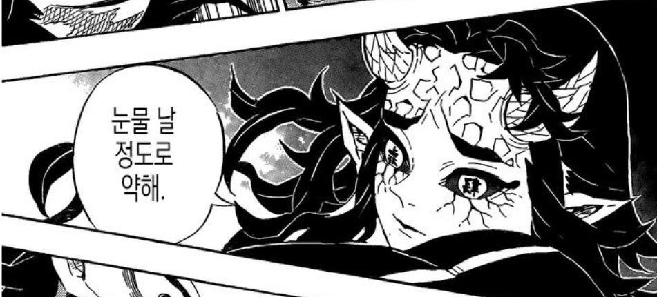
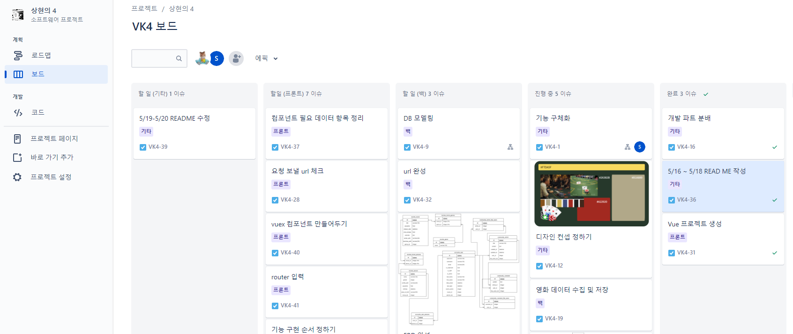
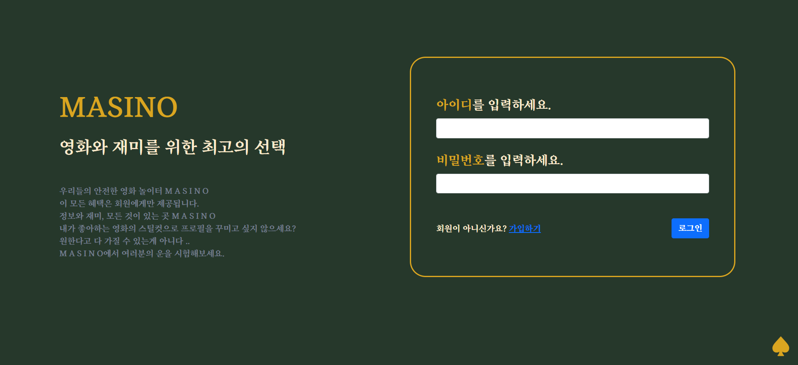
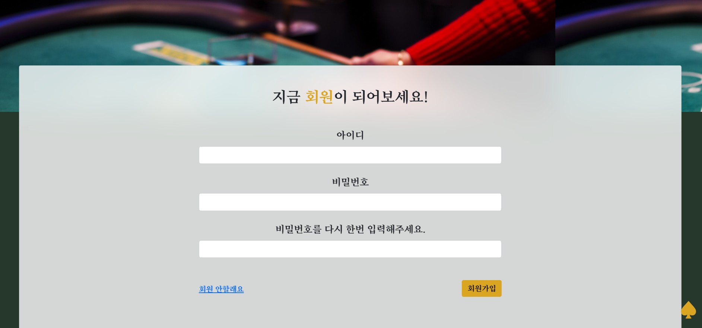
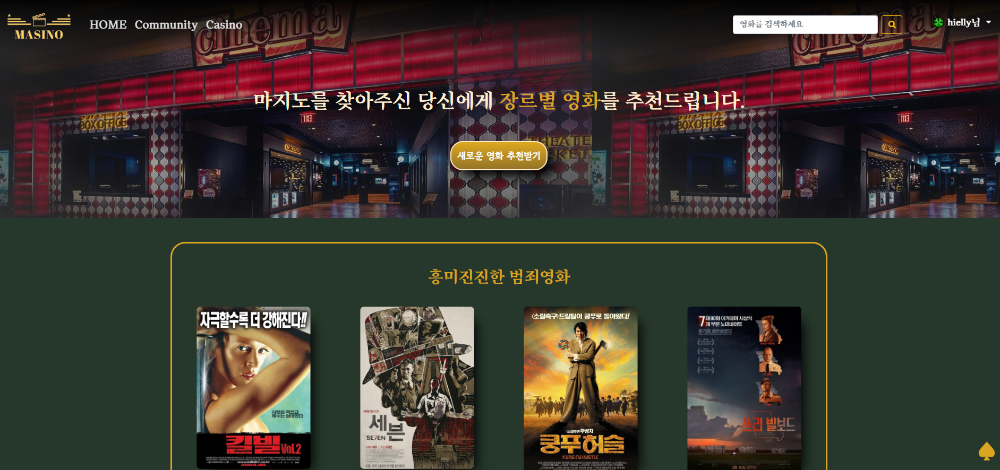
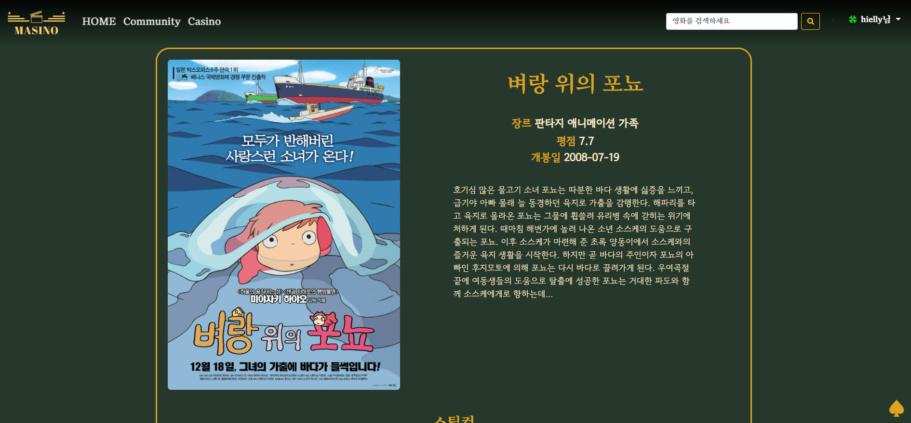
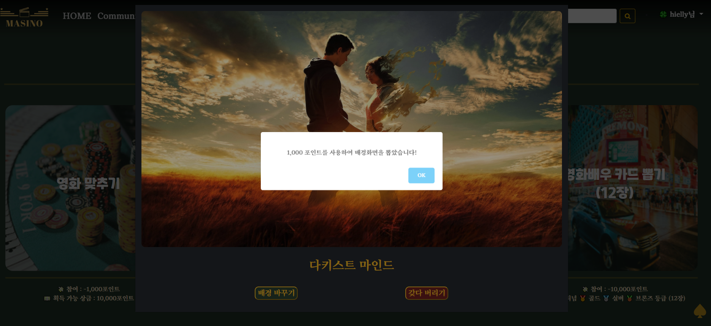

# :clapper: 2022 Movie Website Project  - MASINO:slot_machine:


SSAFY 1학기 최종 프로젝트 : 커뮤니티 기능을 갖춘 영화 추천 웹 서비스를 구현하며 작성하였습니다. 


- 기본 설정 

  - BE

  ```
  loaddata를 통해 데이터를 받아주세요. 
  genredata > moviedata > persondata 순으로 해주시면 됩니다.
  ```

  ```
  데이터를 새로 가져오기 위해서는
  - masino-BE/data 안의 FetchGenreData, FetchMovieData, FetchPersonData의 tmdb api key를 수정해 사용하시면 됩니다. 
  - 약 1~2시간이 소요됩니다.
  ```

  - FE

  ```
  1. npm install 2. npm run serve
  ```


- 이런 상황일 때는 ?! 

  - 로그인 오류

  ```
   로컬 스토리지를 삭제하시고 새로고침 하신 뒤 시도해 주세요.
  ```

  - 영화나 인물 사진 로딩
  
  ```
  빠르게 뜨지 않는다면 데이터 로딩때문입니다. 조금 기다려주세요 ..
  ```
  
  


### 1. 프로젝트 기간 및 목표

---

- 2022.05.17(화) ~ 2022.05.26(목)
- 영화 추천 알고리즘을 적용한 영화 커뮤니티 사이트 구현 


### 2. 팀 정보 및 업무 분담 내역

---

#### 눈물 날 정도로 약한 서`상`균 박지`현의` `4`조 



| 이름                  | 역할         | 업무 분담 내역                                     |
| --------------------- | ------------ | -------------------------------------------------- |
| 서상균 :feet:         | 팀장         | Back-end / Django 서버 구현 / Vue 클라이언트 구현  |
| 박지현 :purple_heart: | 팀원, 젼버덕 | Front-end / Vue 클라이언트 구현 / Django 서버 수정 |


### 3. 개발일지

---

| 날짜       | 진행                    | 내용                                                         |
| ---------- | ----------------------- | ------------------------------------------------------------ |
| 2022-05-16 | 기획                    | 기능 기획                                                    |
| 2022-05-17 | 기획                    | 기능 구체화, 디자인 컨셉 선정, 수집 필요한 데이터 정리       |
| 2022-05-18 | 기획                    | API docs 구성, 목업 작성, 컴포넌트 구조 작성, 영화 데이터 수집 |
| 2022-05-19 | 기획                    | 목업, DB 모델링, ERD 작성 완료, 영화 데이터 수집, Django 프로젝트 설정 |
| 2022-05-20 | 개발                    | **Front**<br />- 프론트 프로젝트 생성<br />- 컴포넌트 생성, router 링크 작성<br />- vuex store 모듈화<br />**Back**<br />- API url 정리<br />- 데이터 가공 및 전송 로직 작성 |
| 2022-05-21 | 개발                    | **Front**<br />- Account login, logout, signup<br />**Back**<br />- Front 개발 단계에 맞춰 로직 수정<br />- 데이터 가공 및 전송 로직 작성 |
| 2022-05-22 | 개발                    | **Front**<br />- Account profile, user update<br />- Community  create<br />**Back**<br />- Front 개발 단계에 맞춰 로직 수정<br />- 영화 추천 알고리즘 작성 |
| 2022-05-23 | 개발                    | **Front**<br />- Community comment, article 전체 완성<br />- Movie search, detail (박지현)<br />- Movie recommend (서상균)<br />**Back**<br />- Front 개발 단계에 맞춰 로직 수정 |
| 2022-05-24 | 개발                    | **Front**<br />- Casino quiz, back gacha, card gacha (서상균)<br />-  개발 완료된 기능 스타일링<br />**Back**<br />- Front 기능 수정에 맞춰 로직 수정 |
| 2022-05-25 | 개발, 디버깅            | **Front**<br />- 개발 완료된 기능 스타일링<br />- 추가 기능 구현 : <br />[완성]<br />Profile 페이지 배우 카드 정렬, Alert 수정 <br />[미완성] <br />Article에 카드 첨부 |
| 2022-05-26 | 개발, 디버깅, 발표 준비 | **Front**<br />- 개발 완료된 기능 스타일링<br />- 추가 기능 구현 <br />[완성]<br />Profile 배우 카드 누르면 배우 정보 나오게 설정 (서상균) |


### 4.  개발 툴

---

- Git을 통한 소스코드 버전 관리 및 협업 
- Jira를 통한 프로젝트 일정 및 자료 관리
  - 

- Figma를 통한 목업 작성
  - 

- Python Web Framework
  - Django 2.1.x
  - Python 3.6.x
- JavaScript Framework 
  - Vue 2.x


### 5. 프로젝트 컨셉 및 주요 기능 

---

#### 5-1. 컨셉

- 카지노 컨셉의 영화 커뮤니티 사이트 
- 글, 댓글 작성, 영화 퀴즈를 통해 포인트를 벌어서 배경, 배우 카드 뽑기를 진행할 수 있다! 
  - 소비자의 수집욕구를 겨냥해 활발한 커뮤니티 기능 사용 유도  


#### 5-2. 영화 추천 알고리즘과 기능 요약

- 추천 알고리즘

  - 영화 장르별 추천 알고리즘
  - 다양한 장르의 유명 영화들을 랜덤으로 12개씩 제공
  - 평점 필터링 / 장르 필터링

   

- 주요 기능

  - 영화 : 영화 추천 및 검색, 간단한 정보 제공
  - 커뮤니티 : 게시글 작성 및 게시글 안에 댓글 작성 기능
  - 카지노 : 포인트 획득할 수 있는 퀴즈, 배경 및 카드 뽑기
  - 프로필 : 현재 포인트, 뽑은 배경, 작성한 글, 보유 카드 확인 가능


### 6. 컴포넌트 구조

---


### 7. 데이터베이스 모델링

---


### 8. 구현한 기능

---


#### 8-1. 시작 화면 



- 로그인 화면
  - 로그인 해야만 모든 서비스를 이용할 수 있다.
  - 완성 전 버전이어서 글이 이상하게 들어가있음
  - 회원이 아니라면 가입창 링크로 연결 
  - 일치하지 않는 항목 / 로그인 오류가 나는 경우에 alert가 뜬다




- 회원가입
  - 일치하지 않는 항목이 있으면 alert가 뜬다.


#### 8-2. 메인 페이지



- 영화 추천 페이지, 새롭게 추천 받기 버튼이 메인에 위치
  - 각 영화의 포스터를 누르면 영화 세부 정보로 이동
  - 오른쪽의 스페이드는 Back to Top 버튼 : 누르면 페이지의 가장 위로 이동한다
  - navbar의 검색창을 통해 언제든지 영화 검색이 가능하다 

- 영화 추천 알고리즘
  - 1차로 평점 순으로 영화를 받아온다 
  - 2차로 보여줄 때 장르로 분류해 추천한다.




- 영화 디테일 페이지 
  - 포스터, 제목, 장르, 평점, 개봉일, 줄거리, 썸네일이 포함된 영화 세부 정보 페이지 


 


- navbar의 검색창으로 검색했을 때의 결과
  - 검색결과가 없을 경우에 알리는 문구가 표시된다.
  - 검색된 영화를 누르면 영화 세부 정보로 이동 


#### 8-3. Community


- 게시판 메인
  - 글 작성 페이지, 작성된 글들이 표시된다.
  - 제목 => 글 디테일, 작성자 => 해당 작성자의 프로필로 이동한다.


- 글 디테일
  - 작성자 (누르면 프로필로 이동), 작성일, 공감, 댓글 수, 글 내용, 댓글과 댓글 작성폼이 포함된다.
  - 글 내용 부분은 스크롤 설정해둬서 일정 크기보다 커지면 자동 스크롤 


- 글 작성 / 수정 페이지 (같은 폼을 사용한다)
  - 제목, 내용 입력
  - 작성시 완료를 누르면 포인트가 들어왔다는 창이 뜬다.


#### 8-4. 카지노


- 포인트 획득 퀴즈 / 뽑기 3 종류로 이루어짐
  - 영화 맞추기 -> 스틸컷을 보고 영화 제목을 맞추면 10,000 포인트 획득 가능 
  - 배경 뽑기 => 랜덤으로 배경을 뽑아 나의 프로필에 설정할 수 있다
  - 카드 뽑기 (1장, 12장) => 배우 카드를 뽑을 수 있다. 총 4가지 등급(유명도 순)으로 나뉘어진다.

- 영화배우 카드 확률표

  - | 1806명   |                       |               |
    | -------- | --------------------- | ------------- |
    | Platinum | popularity >= 40      | 33명, 약 1.8% |
    | Gold     | 40 > popularity >= 21 | 292명, 약 16% |
    | Silver   | 21 > popularity >= 14 | 605명, 약 33% |
    | Bronze   | 14 > popularity >= 10 | 876명, 약 48% |




- 예시는 배경 뽑기
  - 퀴즈 맞추거나 뽑을 때마다 획득 알림이 뜬다 


#### 8-5. 프로필


- 내가 뽑아서 설정한 배경화면
  - 배경화면이 없는 경우에는 안내문구와 카지노로 가는 링크 연결 
- 아이디, 현재 가지고 있는 포인트, 개인정보수정 (이메일 하나), 작성글, 가지고 있는 카드들 포함
  - 글 제목을 누르면 글 디테일로 이동한다.


- 내 배우 카드 
  - 등급 순서대로 정렬 (기본)
  - 위의 버튼을 통해서 등급별로 볼 수 있다
  - 카드를 누르면 해당 배우의 정보(이름, 생년월일, 출생지, 출연 작품)가 담긴 모달창 
